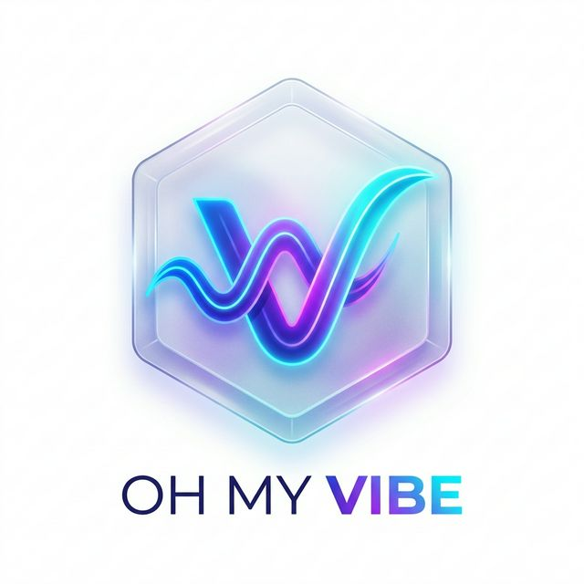

<p align="center">
  
</p>

# Oh My Vibe Userscript 🌈

[](https://opensource.org/licenses/MIT)
[]()

**Oh My Vibe Userscript** là kho tổng hợp các bộ script Tampermonkey giúp tối ưu hóa trải nghiệm, tăng năng suất và mang lại "vibe" hiện đại cho các trang web bạn sử dụng hàng ngày.

## ✨ Các bộ script hiện tại

### 🏠 Academic / University (sv.dut.udn.vn)

- **Enhancer for SVDUT**: Tiện ích hiện đại hóa cổng thông tin sinh viên Bach Khoa Da Nang.
  - [Cài đặt ngay](https://github.com/hthienloc/oh-my-vibe-userscript/raw/main/scripts/academic/enhancer-for-svdut.user.js)
- **DUT WiFi Auto-Login**: Tự động đăng nhập hệ thống WiFi E4T.
  - [Cài đặt ngay](https://github.com/hthienloc/oh-my-vibe-userscript/raw/main/scripts/academic/dut-auto-login.user.js)

### 📱 Social Media (Facebook)

- **Facebook Affiliate Comment Filter**: Tự động nhận diện và ẩn bình luận rác, link Shopee/Lazada affiliate.
  - [Cài đặt ngay](https://github.com/hthienloc/oh-my-vibe-userscript/raw/main/scripts/social/filter-fb-affiliate.user.js)
- **Do Mixi Gemini**: Tiện ích dành riêng cho cộng đồng Bộ tộc MixiGaming.
  - [Cài đặt ngay](https://github.com/hthienloc/oh-my-vibe-userscript/raw/main/scripts/social/do-mixi-gemini.user.js)

### 🎵 Media / Downloaders

- **SoundCloud Downloader**: Tải nhạc trực tiếp từ trang SoundCloud với đầy đủ metadata.
  - [Cài đặt ngay](https://github.com/hthienloc/oh-my-vibe-userscript/raw/main/scripts/media/soundcloud-downloader.user.js)

## 🚀 Cài đặt chung

1. Cài đặt trình quản lý userscript: **[Tampermonkey](https://www.tampermonkey.net/)**.
2. Duyệt danh sách script ở trên và nhấn vào link **Cài đặt ngay** tương ứng.
3. Nhấn **Install** ở cửa sổ hiện ra.

## 🛠️ Phát triển

Tất cả script đều được phát triển bằng JavaScript thuần túy, ưu tiên hiệu năng và tính ổn định.

### Cấu trúc project

```text
.
├── assets/         # Tài nguyên hình ảnh, logo
├── scripts/        # Danh sách script đã phân loại
│   ├── academic/   # Các script hỗ trợ học tập
│   ├── social/     # Các script mạng xã hội
│   └── media/      # Các script đa phương tiện
└── README.md
```

## 📜 Giấy phép

Phân phối theo giấy phép MIT. Xem `LICENSE` để biết thêm chi tiết.

---
Phát triển bởi **hthienloc**.
